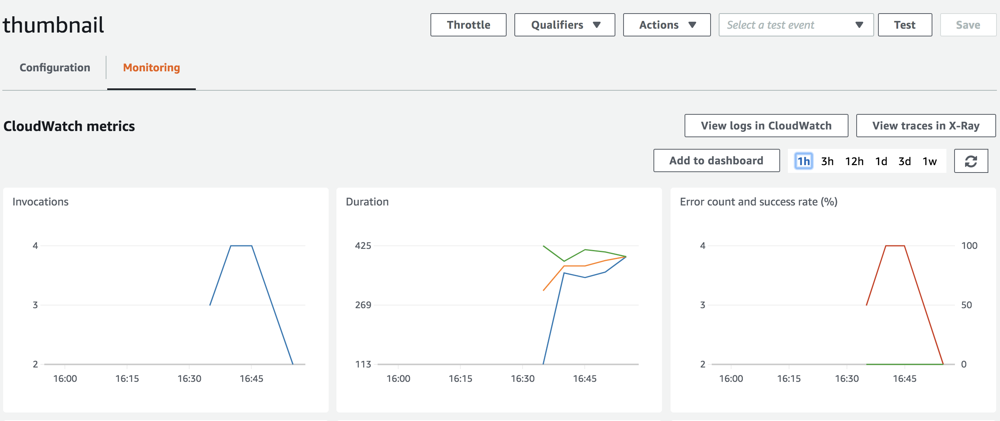

# TaskMaster

## What is this app
Manages tasks with 4 states for status and an assignee

## Routes

    + @GetMapping({"/tasks"}) -> returns all tasks in db
    + @PostMapping({"/tasks"}) -> add Task object via Request Body - need to send Task object with
        title, description, assignee properties
    + @PostMapping({"/tasks/{title}/{description}"}) -> adds a new task via query params
    + @PutMapping({"/tasks/{id}/state"}) -> updates state
        + this route will not change the assignment if there is no assignee (null or empty String)
    + @PutMapping({"/tasks/{id}/assign/{assignee}"}) -> updates Task to assignee
        + this route will not change the assignee if the same one was already assigned
        + this route will change the status to "assigned" if the Task is updated
    + @DeleteMapping({"tasks/delete/{id}"}) -> deletes a Task by id
    + @GetMapping({"/tasks/{id}"}) -> fetches one Task by id
    + @PostMapping({"/tasks/{id}/images"}) -> updates existing Task image property

## Issues
    + dependencies
    + needed to use Postman, as using local means my routes could only be Get
    + GIT ISSUES - user error, but frustrating
    + needed to have region specified
    
## Lambda Warmer

## Lab: Event Driven Architecture

### Overview

For this assignment, we will be wiring up our Queues with live running cloud based code, creating a distributed, event driven architecture.

### Feature Tasks

#### Taskmaster vX

Using Queues and Notifications ...

+ Send an email to an administrator when a task is completed
+ Send a text to the person to whom a task is assigned (when it gets assigned)
+ When a task is deleted from Dynamo, trigger a message that will fire a lambda to remove any images associated to it from S3
+ Instead of having S3 run the resizer automatically on upload, evaluate the size of the image in your Java code and then send a message to a Q, that will in turn trigger the lambda resizer -- only when the image > 350k

### Sources
[using params](https://docs.aws.amazon.com/systems-manager/latest/userguide/sysman-paramstore-cwe.html)
[noSql triggers](https://aws.amazon.com/blogs/compute/619/)
[streams](https://docs.aws.amazon.com/amazondynamodb/latest/developerguide/Streams.Lambda.Tutorial.html#Streams.Lambda.Tutorial.CreateTable)
[SNS](https://docs.aws.amazon.com/sns/latest/dg/sns-how-it-works.html)

### Blockers
Lack of direction / instruction
Everything
